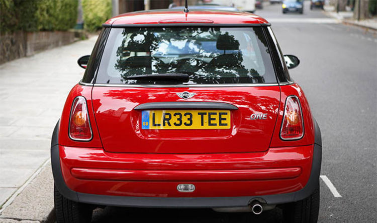

># Car Park Automation
># Table of Content
- [Car Park Automation](#car-park-automation)
- [Table of Content](#table-of-content)
- [Group Members](#group-members)
- [Introduction](#introduction)
- [Licence Plate Detection](#licence-plate-detection)
  - [Image Acquistion](#image-acquistion)
  - [Licence Plate Extraction](#licence-plate-extraction)
  - [Licence Plate Segmentation](#licence-plate-segmentation)
  - [Character Recognition](#character-recognition)
- [Possible Paths](#possible-paths)
- [Output](#output)
># Group Members
- Cyril Yamoah [@ceesiyamoah](https://github.com/ceesiyamoah)
- Joseph Sarpong [@KwesiJoe](https://github.com/KwesiJoe)
- Sarah Addai

># Introduction
This project aims to solve the issue of the management of car parks in Ghana. Often in car parks, Attendants have to note the entry time and departure time of the vehicle before making a charge and issuing a receipt. There are also cases where anyone who has to use the parking lot has to be issued a ticket upon entry and on exit will have to produce this receipt. These methods can be inefficient and time wasting. 
 
>> **Car Park Automation** seeks to eliminate these issues by using the number plates of vehicles entering and exiting the parking lot. **Car Park Automation** uses Computer Vision(*Artificial Neural networks*) to detect the number plates using images from a camera positioned at points of entry and exit of the parking lot.

Upon entry, a car's number plate and time of entry are stored in a database. On exiting, the car's number plate is searched for in the database and when found, the departure time is noted. The total time and the total cost incurred are calculated and displayed to the user/ to the management system. 

># Licence Plate Detection
>>## Image Acquistion 
 The images will be obtained directly from cameras installed at the entry and exit points. 
 To enforce that all images will work well with the model, the picture taken by the camera will have to:
 
 - Be bright enough to see the number plate.
 - Be directly aligned with the camera

**Figure 1: Acquired Image**

When the image is acquired it is sent to the system for analysis.
>>## Licence Plate Extraction
When the model is fed the image it does the following:

1. A Grayscale filter is applied
2. A blur filter is applied
3. Canny edge detector filter is applied
4. Search for characters in the image
5. Select locations where characters are mostly gathered as a possible number plates
6. Select a location from the possible number plates where the characters are bounded by a rectangle and its boundaries are noted.
>>## Licence Plate Segmentation
Using the boundaries obtained from Licence Plate Segmentation, an image of the number plate is cropped from the original image and saved to a database for processing.

**Figure 2: Segmented number plate**

>>## Character Recognition

Once the number plate has been segmented from the image, we run it through an already trained Optical Character Recognition Neural Network to detect the various characters. The characters in the number plate are recognized individually and then appended together. Once all characters have been recognized the number plate and the time entered are recorded in a database.

># Possible Paths

There will be two separate cameras:
-  Entry
: When a car enters the number plate is detected and then stored along with the the vehicle entered the park and stored in a database.
-  Exit 
:  When a car is exiting, the model recognises the number plate and searches through the system for that number plate. When found it appends the time exited to the corresponding row and then calculates the time spent in the lot and charge (if applicable)

># Output 
Upon exiting, details of a vehicle's stay is shown as below 
<table>
<tr>
    <td>Number Plate detected</td>
    <td>LR33TEE</td>
</tr>
<tr>
    <td>Time In:</td>
    <td>2020-09-11 3:26:33</td>
</tr>
<tr>
    <td>Time Out:</td>
    <td>2020-09-11 5:26:33</td>
</tr>
<tr>
    <td>TimeSpent:</td>
    <td>2 hours, 0 minutes</td>
</tr>
<tr>
    <td>Charge:</td>
    <td>GHS 10.00</td>
    <td>* if applicable</td>
</tr>
</table>

># To use run Main. py

